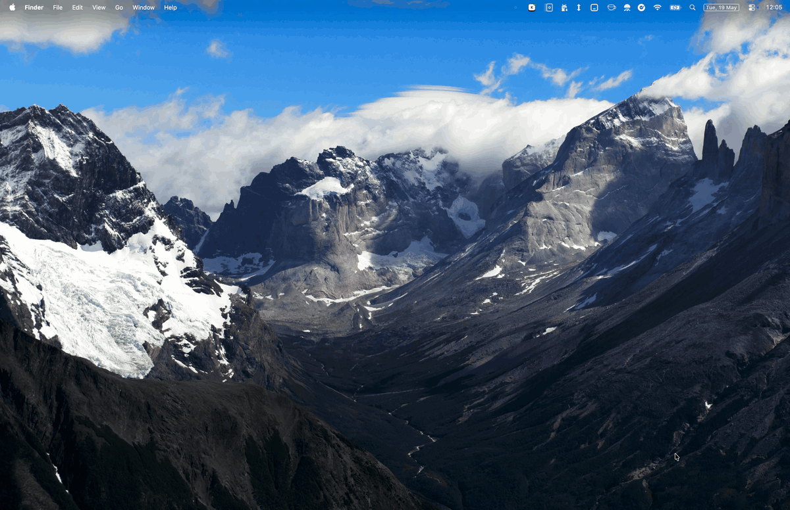
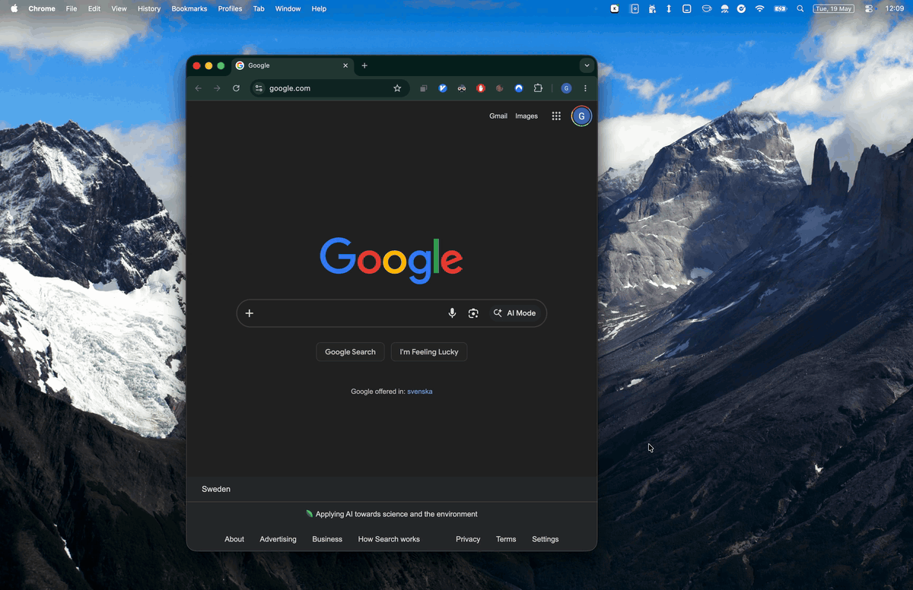
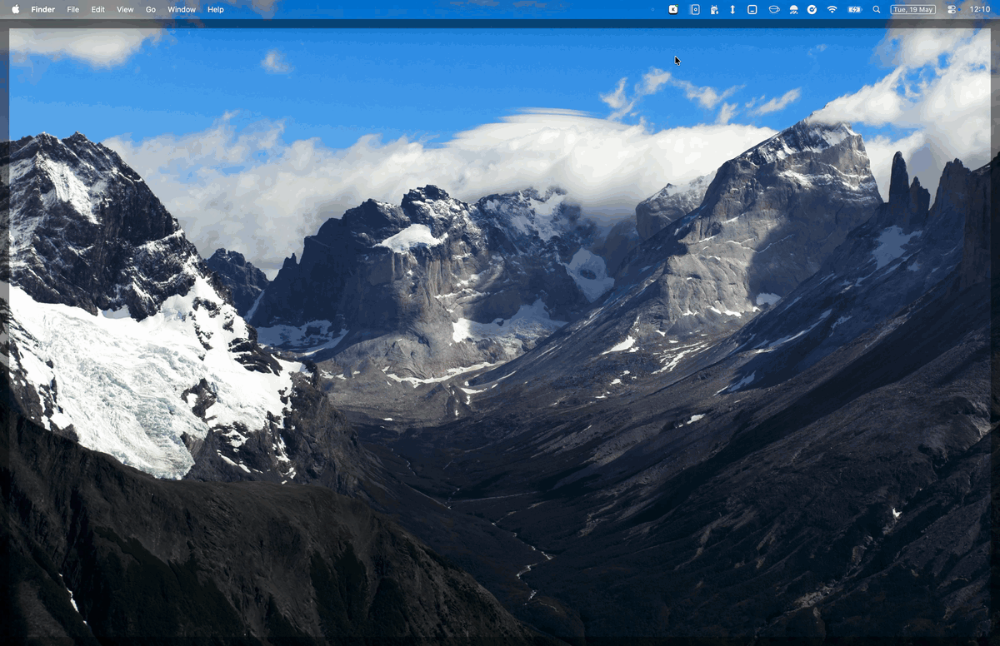

<p align="center">
  
  <h2 align="center">jWM — janzo's Window Manager</h2>
</p>

<p align="center">A simple tiling window manager for MacOS.</p>
<p align="center">It combines app focusing and window tiling into a single key-chord interaction.</p>
<p align="center">(Vim-like keybindings supported!)</p>

<table>
  <tr>
    <th>App Focusing<br><code>⌘</code> + <code>&lt;N&gt;</code></th>
    <th>Window Tiling<br><code>⌘</code> + <code>⌃</code> + <code>←</code>/<code>↓</code>/<code>↑</code>/<code>→</code><br>(or mouse)</th>
    <th>✨ App Focusing +<br>Window Tiling ✨<br><code>⌘</code> + <code>&lt;N&gt;</code> + <code>←</code>/<code>↓</code>/<code>↑</code>/<code>→</code></th>
  </tr>
  <tr>
    <td>
      
    </td>
    <td>
      
    </td>
    <td>
      
    </td>
  </tr>
</table>

## Why jWM?

I've been a happy [Rectangle](https://rectangleapp.com/) user for a few years, but the problem with it is that you always have to focus the app you're interested in, _and then_ you can move it around using Rectangle. My solution was to use [Raycast](https://www.raycast.com/) to quickly launch or focus the application I wanted to move with Rectangle.

That worked, but I came to dislike having to always perform two separate operations to move a single window. `jWM` solves this issue by combining app focusing and window tiling in a single key-chord.

## Installation

Install via [Homebrew](https://brew.sh):

```bash
brew install --cask giovanniberi93/jwm/jwm
```

(That's a shortcut for `brew tap giovanniberi93/jwm && brew install --cask jwm`.)

> ***Why does macOS block jWM on first launch?***
>
> jWM is distributed unsigned (no $99/yr Apple Developer Program). The first launch hits Gatekeeper. Either right-click `jWM` in `/Applications` and choose **Open**, or remove the quarantine attribute:
>
> ```bash
> xattr -dr com.apple.quarantine /Applications/jWM.app
> ```

After launch, grant Accessibility permission when prompted: **System Settings → Privacy & Security → Accessibility**.

## Usage

### App focusing: `⌘`+`<N>`, `⌘`+`⇧`+`<N>`

In jWM settings in the menu bar, each number key (0-9) can be bound to two apps:
- main app binding: `⌘`+`<N>`
- alternate app binding: `⌘`+`⇧`+`<N>`

For example, you could use `⌘`+`3` for Chrome, and `⌘`+`⇧`+`3` for Safari.

The app bindings can then be used to focus (or launch) the corresponding apps.

### Tiling currently focused window

Tile the currently focused window:

| Keys | Vim keys | Action |
|------|----------|--------|
| `⌃`+`⌘`+`←` | `⌃`+`⌘`+`h` | Left half of the screen |
| `⌃`+`⌘`+`→` | `⌃`+`⌘`+`l` | Right half of the screen |
| `⌃`+`⌘`+`↓` | `⌃`+`⌘`+`j` | Full screen |
| `⌃`+`⌘`+`↑` | `⌃`+`⌘`+`k` | Move to next screen (fullscreen) |

> ***Wait, no screen thirds, or horizontal halves?***
>
> I pretty much only use vertical screen halves, so I'm focusing on those now.
>
> ***Why both arrows and `h`/`j`/`k`/`l`?***
>
> Arrows are the default, but there's a settingto switch to vim-like (`h`/`j`/`k`/`l`) keys instead: same layout, just on the home row.
### Focusing and tiling a different app

After pressing `⌘`+`<N>` or `⌘`+`⇧`+`<N>` to select an app, keep holding `⌘` and press a position key to tile the window of the selected app:

| Key | Vim key | Position |
|-----|---------|----------|
| `←` | `h` | Left half of the screen |
| `→` | `l` | Right half of the screen |
| `↓` | `j` | Full screen |
| `↑` | `k` | Move to next screen (fullscreen) |

### Launch all configured apps

Press `⌃`+`⌘`+`a` to launch (or focus) every app bound to any slot, each tiled full screen. Useful at system startup to bring up your full workspace in one keystroke.

### Mouse support

Drag any window to the left or right screen edge to tile it. A preview overlay shows the target position.

## Troubleshooting

### Disable conflicting macOS built-in window tiling

macOS has its own drag-to-edge tiling that conflicts with jWM. Check the "Conflicting macOS settings" section in the settings to make sure all macOS settings are set properly.

### Reset accessibility permissions

jWM needs Accessibility access to manage windows. macOS will prompt on first launch. If it stops working after a rebuild, reset the permission:

```bash
make reset-accessibility-permissions
```

## Development

Building from source requires [Xcode](https://xcodereleases.com/) (developed against Xcode 26.3 on macOS Tahoe 26.3.1).

- `make dev` — build and run without installing.
- `make install` — build and install into `/Applications/jWM.app`.

## Contributors

- **janzo**
- **Claude** 

## License

Do whatever you want with jWM.
